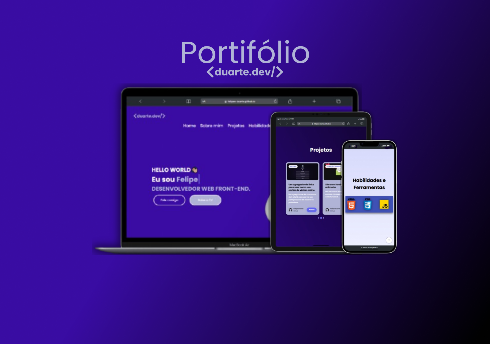

<h1 align="center"> Portifólio </h1>

  <a href="https://felipee-duarte.github.io/Portifolio/">Projeto</a>&nbsp;&nbsp;&nbsp;|&nbsp;&nbsp;&nbsp;
  <a href="#">Tecnologias</a>&nbsp;&nbsp;&nbsp;|&nbsp;&nbsp;&nbsp;
  <a href="https://www.figma.com/design/faVsSbqBmAzCBN9cHeOkPH/Portif%C3%B3lio?node-id=0-1&p=f&t=0WK6gdW1sacs12dn-0">Layout</a>&nbsp;&nbsp;&nbsp;

  

 

  

## 🚀 Tecnologias

Esse projeto foi desenvolvido com as seguintes tecnologias:

- HTML e CSS
- JavaScript
- Git e Github
- Figma

## 💻 Projeto

Meu site portifólio 100% responsivo, como modo escuro e claro, nele inclui um carrossel com meus projetos e um carrossel infinito com minhas habilidades e ferramentas.

- [Acesse o projeto finalizado, online](https://felipee-duarte.github.io/Portifolio/)

## 🔖 Layout

Você pode visualizar o layout do projeto através [DESSE LINK](https://www.figma.com/design/faVsSbqBmAzCBN9cHeOkPH/Portif%C3%B3lio?node-id=0-1&p=f&t=0WK6gdW1sacs12dn-0). É necessário ter conta no [Figma](https://figma.com) para acessá-lo.

## 📝 Licença

Esse projeto está sob a licença MIT.

---

    Feito por Felipe Duarte

